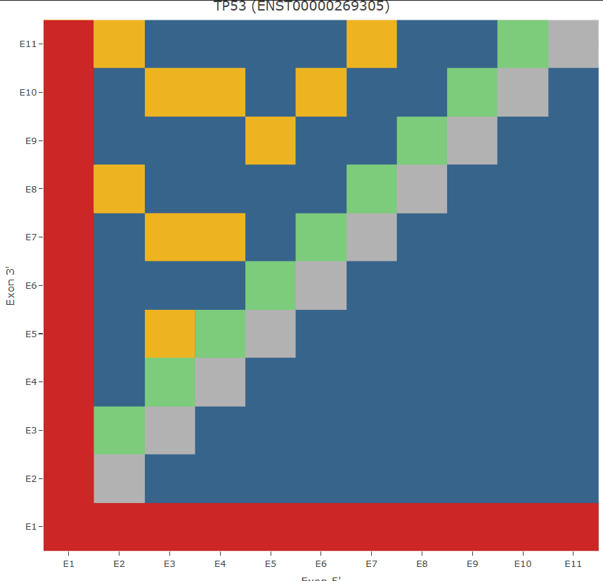

```{r setup, include = FALSE}
knitr::opts_chunk$set(
  collapse = TRUE,
  comment = "#>"
)
```

## Overview

`mutateR` streamlines design of frame-aware CRISPR/Cas-mediated deletions.

It identifies pairs of non-contiguous exons in a given transcript that are phase-compatible with each other (*i.e.*, pairs of exons that do not normally neighbour each other in the transcript, but the 5' exon ends in the same reading frame position (0, 1, or 2) as the 3' exon begins with), then detects gRNAs in each exon that facilitate their deletion such that the resulting mutant allele preserves the original reading frame.

### Background

The underlying motivation is to facilitate the generation of mutant alleles that are not prone to nonsense-mediated decay (NMD), which can induce transcriptional adaptive responses ([El-Brolosy et al., *Nature* (2019)](https://doi.org/10.1038/s41586-019-1064-z "Genetic compensation triggered by mutant mRNA degradation") and [Ma et al., Nature (2019)](https://www.nature.com/articles/s41586-019-1057-y "PTC-bearing mRNA elicits a genetic compensation response via Upf3a and COMPASS components")). This behaviour can attenuate the phenotypic potency of mutant alleles, making the study of gene loss-of-function more difficult.

NMD is a complex process that cells use to survey and degrade transcripts that contain a premature termination codon (PTC). This generally occurs when a mutation causes a frameshift, resulting in a termination codon being introduced in a non-terminal exon. During splicing of mature mRNA, exon junction protein complexes (EJCs) are deposited at exon-exon junctions; during translation, the ribosome displaces these complexes. If a ribosome encounters a PTC **at least 50 nucleotides** upstream of the last exon-exon junction, it will fail to displace any downstream EJCs. The remaining EJC(s) will interact with termination factors to induce decay of the PTC-bearing transcript.

While the degradation of PTC-bearing mRNAs protects the cell from producing potentially toxic truncated proteins, the mRNA fragments that result from NMD can induce upregulation of other ('adapting') genes. This effect is a compensatory behaviour termed *'transcriptional adaptation'*, and can cause masking of gene loss-of-function phenotypes.

### Why does this matter?

Suppose you are studying a novel gene of interest ('A'). Gene A is expressed in the brain, and you hypothesise that loss of Gene A causes a brain growth phenotype. When you knock down expression of Gene A in your model organism of choice, you see the expected stunting of brain development; however, when you look at the brains of animals homozygous for a frameshift mutation causing a PTC early in the gene, the brains look normal. Gene A is functionally related to, and expressed in the same region as, another gene ('B'). When you measure expression of Gene A and Gene B in these brains, you see little to no Gene A expression, but Gene B is expressed at higher levels than in brains from animals that do not have this mutation. This is because Gene B has compensated for the loss of Gene A by responding to the mRNA fragments produced by NMD of the Gene A transcript. While this is *great* for the animal (it has a largely "normal" brain!), it means that we can't really use our Gene A mutant to reliably study the effects of loss of Gene A function.

### How can we prevent this?

In short, **use tools for targeted mutagenesis to their strengths**. Back when the only way to make a mutant animal was to randomly mutagenise its genome and then recover alleles based on phenotypes, researchers didn't have a great deal of control over the nature of the resulting alleles. Modern sequence-targeting methods (such as CRISPR/Cas9) allow for much more control over the nature of the mutations that we can generate.

If we delete parts of a gene that correspond to functional domains of the encoded protein, but maintain the original reading frame (such that there is no PTC), we are left with a stably-expressed, truncated mutant transcript that does not encode a functional protein but also does not induce transcriptional adaptation via NMD.

> *Note*: There is nuance to NMD induction. For example, PTCs are much better tolerated (*i.e.*, do not induce NMD) if they occur in the transcript's terminal exon. For an excellent quantitative study of NMD induction relative to transcript PTC position, please see [Lindeboom, Supek and Lehner, *Nature Genetics* (2016)](https://doi.org/10.1038/ng.3664 "The rules and impact of nonsense-mediated mRNA decay in human cancers").

This type of deletion can be achieved by simultaneously targeting two sites in the gene of interest; the intervening region between the two targeted sites will be excised, and the ends of the genetic lesion are joined together by DNA repair mechanisms.

## How does `mutateR` work?

`mutateR` uses `biomaRt` to retrieve transcript and exon phase information for your gene of interest, then calculates which pairs of non-contiguous exons are phase-compatible. It then scans these exons for Cas effector PAMs (currently Cas9 NGG and Cas12a TTTV) associated with protospacers that do not cross exon boundaries. After calculating on-target scores for potential gRNAs using rule sets from `crisprScore` ([Hoberecht et al., *Nature Communications* (2022)](https://www.nature.com/articles/s41467-022-34320-7 "A comprehensive Bioconductor ecosystem for the design of CRISPR guide RNAs across nucleases and technologies")) where possible, or by manuel re-implementation of methods not available from `crisprScore`, `mutateR` returns recommended gRNA pairs to target exons where the flanking exons are in-frame with each other. It also produces a graphical representation of the selected transcript, its phase-compatible exons, and the recommended exon pairs for targeting.

> As of December 2025, `mutateR` utilises a Python backend (via `reticulate`) to allow for implementation of python-dependent functionalities. This was originally done to implement deep-learning-based on-target scoring methods (dependent on TensorFlow etc.) which could not be accessed by Windows OS users from `crisprScore`, but now is also required for the primer design facet of the `run_mutateR` pipeline (via `primer3-py`).
>
> As these core functionalities (and likely future ones) use the Python backend, it is **highly recommended** that all `mutateR` users install and activate the `r-mutater` Python env (containing all the requisite modules) from within `mutateR`. See the relevant Installation section ([Setting up the mutateR Python backend]) below for more information.

The `mutateR` package consists of the following ordered functions:

| Step | Function | Functionality |
|------------------------|------------------------|------------------------|
| 1 | `get_gene_info()` | Query Ensembl for gene and transcript metadata. |
| 2 | `get_exon_structures()` | Retrieve exon coordinates and phase metadata. |
| 3 | `find_cas9_sites()`/`find_cas12a_sites()` | Identify nuclease recognition sites. |
| 4 | `check_exon_phase()` | Determine phase-compatible exon pairs. |
| 5 | `check_frameshift_ptc()` | Calculate and flag frameshift/PTC consequences. |
| 6 | `map_protein_domains()` | Retrieve protein domain annotations from InterPro corresponding to exons. |
| 7 | `score_gRNAs()` | Score guide RNAs via `crisprScore`. |
| 8 | `filter_valid_gRNAs()` and `assemble_gRNA_pairs()` | Filter allowed gRNA pairs and assemble into a readable data.frame. |
| 9 | `plot_gRNA_design()` | Visualise phase compatibility of non-contiguous exon pairs and top-ranked valid gRNA pairs. |
| 10 | `plot_grna_heatmap()` | For large gene (\>12 exons) visualisation - helper function for `plot_grna_design()` but can be executed separately. |
| 11 | `plot_grna_interactive()` | Helper function for interactive plotting mode. |
| 12 | `run_mutateR()` | Wrapper; runs entire pipeline. |
| 13 | `mutateR_viewer()` | Launches an Shiny app for gRNA extraction from an interactive heatmap. |

`mutateR` also has an additional function, `design_gRNA_pairs()`, that is not included in the wrapper function. This function can be used in isolation to produce a data.frame of gRNA pairs for the gene of interest. Other scripts such as `deep_learning_utils.R`, `python_env.R`, `primer3-backend.R` and `design_primers.R` contain helper functions that are critical but not directly user-executed pipeline components.

## Getting started

### Installation

Currently, `mutateR` can be installed from GitHub:

```{r install, eval=FALSE}
devtools::install_github("amdouek/mutateR")
library(mutateR)
```

Running `mutateR` requires only installation of the package itself, and that you have also installed the `BSgenome` R package for your species of interest (e.g., `BSgenome.Hsapiens.UCSC.hg38` for human). These BSgenome data packages can be quite large, so are not installed alongside `mutateR`.

> For convenience's sake, here are the Bioconductor pages to install the genomes for commonly-used species:
>
> -   [human (hg38)](https://doi.org/doi:10.18129/B9.bioc.BSgenome.Hsapiens.UCSC.hg38),
>
> -   [mouse (mm10)](https://doi.org/doi:10.18129/B9.bioc.BSgenome.Mmusculus.UCSC.mm10),
>
> -   [rat (rn7)](https://doi.org/doi:10.18129/B9.bioc.BSgenome.Rnorvegicus.UCSC.rn7),
>
> -   [zebrafish (danRer11)](https://doi.org/doi:10.18129/B9.bioc.BSgenome.Drerio.UCSC.danRer11),
>
> -   [*Drosophila melanogaster* (dm6)](https://doi.org/doi:10.18129/B9.bioc.BSgenome.Dmelanogaster.UCSC.dm6)
>
> -   [*Caenorhabditis elegans* (ce11)](https://bioconductor.org/packages/release/data/annotation/html/BSgenome.Celegans.UCSC.ce11.html)
>
> You can also see all genomes currently available through `BSgenome` by running `BSgenome::available.genomes()`.

### Setting up the `mutateR` Python backend

In order to use the full suite of functionalities in `mutateR` (e.g., automated genotyping primer design, all gRNA on-target scoring methods), you must install and activate the package's Conda environment. This env contains all the necessary dependencies for Python-reliant package functions.

#### Install `reticulate`

`reticulate` is the [R interface to Python](https://rstudio.github.io/reticulate/) required to run `mutateR` as intended. You can install it from CRAN if needed, but it is imported upon installation of `mutateR`.

#### Install the `r-mutater` Python env

Installing the Python backend is simple: In R, after installing and loading the `mutateR` package, simply run the command `install_mutater_env()`.

> If you have never used Python before, it likely does not yet exist on your device. If this is the case, and you are running `mutateR` for the first time, this command will install [Miniconda](https://www.anaconda.com/docs/getting-started/miniconda/main) via `reticulate`. This might take a few minutes - ensure it completes fully before proceeding.

This command will create an env called `r-mutater` with the specified `python_version` containing the following dependencies: `"tensorflow-cpu", "numpy<2", "h5py", "pandas", "scipy", "primer3-py"`.

If for whatever reason the env has not been installed correctly (or if a new dependency has been added), rerun the installation with the parameter `fresh = TRUE` to remove and reinstall the env.

**Important:** Restart your R session (Ctrl/Cmd + Shift + F10) after installation is complete.

#### Activate the env

After **restarting your R session**, run `activate_mutater_env()` to point your R session to the `r-mutater` env. `reticulate`'s default env is `RETICULATE_PYTHON`; `activate_mutater_env()` will unset this and set it as `r-mutater`. This will only last for the current R session and will revert to the default upon session restart (i.e., you will need to reactivate the env each time you initiate a new session, but you will only need to *reinstall* the env if a new dependency is added or if it is corrupter).

Once the env is successfully activated, `[1] TRUE` will be printed in the console. At this point, you will be able to make use of the full suite of `mutateR` functionalities.

## The `mutateR` workflow

In the below example run, we will run `mutateR` on human *TP53* to select optimal Cas9 gRNA pairs*.* Assuming you have installed both `mutateR` and your BSgenome of choice (in this case, human), and set up the Python backend correctly:

```{r, message=FALSE}
library(reticulate)
library(mutateR)
library(BSgenome.Hsapiens.UCSC.hg38)

activate_mutater_env()
```

The wrapper function `run_mutateR()` executes the full pipeline (using the canonical transcript by default). For human *TP53:*

```{r}
tp53_res <- run_mutateR(
  gene_id = "TP53",
  species = "hsapiens",
  genome = BSgenome.Hsapiens.UCSC.hg38,
  nuclease = "Cas9",
  score_method = 'ruleset1',
  design_primers = TRUE,
  quiet = FALSE,
  plot_mode = 'heat'
  )
```

> Note that this function also reports a PAM distribution. In the case of *TP53*, CGG PAMs are significantly underrepresented amongst those identified by `mutateR`, as is generally expected in the human exome (see [Yang, Zhu and Jin, *BMC Genomics* (2024)](https://bmcgenomics.biomedcentral.com/articles/10.1186/s12864-024-11073-9) and [Scott and Zhang, *Nature Medicine* (2017)](https://pmc.ncbi.nlm.nih.gov/articles/PMC5749234/)).

The object `tp53_res` is a list with the following levels:

```{r}
names(tp53_res)
```

With the actual selected gRNA pairs (with associated metadata) stashed as a data.frame in `tp53_res$pairs`.

```{r}
kableExtra::scroll_box(knitr::kable(head(tp53_res$pairs,5)),width = '700px')
```

By default, all pairs are present in this data.frame; if you are interested in only those that `mutateR` recommends, simply filter for `recommended == TRUE`.

```{r}
tp53_recommended <- filter(tp53_res$pairs, tp53_res$pairs$recommended == TRUE)
kableExtra::scroll_box(knitr::kable(head(tp53_recommended,5)),width = '700px')
```

### Interpreting the `run_mutateR()` output

##### The `pairs` data.frame

`$pairs` contains several columns - some of these are not strictly useful for the end-user (e.g. genomic coordinates), but most represent the primary output of the pipeline. The below sections will elaborate on these:

###### Flanking and targeted exons

`upstream_exon` and `downstream_exon` refer to the two phase-compatible exons, while `exon_5p` and `exon_3p` refer to the 5-prime and 3-prime exons to simultaneously target using the selected gRNAs in that row of the data.frame.

###### Pair classification flags

Each gRNA pair is annotated by several classifications. The `compatible` flag (`run_mutateR()` currently only returns compatible exon pairs) highlights if the exon pair is phase-compatible; if a non-compatible exon pair were used, one might expect the `frameshift` and `ptc_flag` values to be `TRUE`. The `terminal_exon_case` flag is used for a special case, where a frameshift has introduced a PTC into the terminal exon of the selected transcript. Final-exon PTCs induce NMD with far lower efficiency than those in non-terminal exons, and are significantly less likely to result in transcriptional compensatory behaviour.

###### gRNA pairs and associated deletion sizes

The actual gRNA protospacer sequences are given in `protospacer_sequence_5p` and `protospacer_sequence_3p` (with 5p and 3p referring to the relative position in the transcript of the gRNAs in the given pair), and the corresponding PAMs in `pam_sequence_5p` and `pam_sequence_3p` respectively.

> Note that while both + and - strands are scanned for PAMs, the - strand sequences are automatically reverse-complemented so will always display NGG PAMs (instead of CCN).

For each gRNA pair, the expected deletion size at both the genomic and transcript level is reported in `genomic_deletion_size` and `transcript_deletion_size`, respectively.

###### Genotyping primers and amplicon sizes

`run_mutateR()` now also automatically generates a pair (or two, depending on the nature of the deletion - see [A note on primer design] below) of primers for genotyping the resulting deletion produced by the gRNA targeting. `priming_strategy` reports the genotyping approach used (either 'Flanking' [one primer pair] or 'Dual Pair' [two primer pairs]); `primer_ext_fwd` and `primer_ext_rev` for the deletion-flanking primer sequences, and `primer_int_fwd` and `primer_int_rev` for primer pair sequences nested within the deleted region (Dual Pair only). `exp_wt_size` reports the expected wild type amplicon size, and `exp_mut_size` the expected mutant amplicon size from the flanking primers. `exp_int_size` reports the amplicon size for the nested primer pair.

###### gRNA scoring

The currently working scoring methods are `"ruleset1"` and `"deepspcas9"` for Cas9, and `"deepcpf1"` for Cas12a.

Each 5-prime and 3-prime gRNA sequence also has corresponding `ontarget_score` relating to whatever scoring method you selected when executing `run_mutateR()`. Note that the nature of the score will differ between methods (e.g., `"ruleset1"` reports a probability value between 0-1, while `"deepspcas9"` reports a scalar linear regression value (usually 0-100, occasionally negative).

###### Other 

`domains` contains protein domain annotations corresponding to the region to be deleted derived from the `map_protein_domains()` function, while the `recommended` flag is `TRUE` if the gRNA pair meets all validity criteria (including both gRNAs passing the on-target scoring threshold). Importantly, genotyping primers are only generated for recommended gRNA pairs.

##### Visualisation

###### Static visualisation modes

`mutateR` also produces a basic visualisation for exon phase-compatibility, by default a heatmap.

```{r mutateR_plot_heatmap, fig.width=10, fig.height=8}
tp53_res$plot
```

The x-axis represents the 5-prime exon, and the y-axis the three-prime exon, to represent a given exon pair. UTR-containing exons are in red, contiguous exons in green, while non-contiguous phase-compatible exons are in yellow. All incompatible exon pairs are blue.

Domain annotations from Pfam are provided in a secondary plot element below the heatmap x-axis to assist you in selecting regions should you wish to ablate specific functional domains.

The partially deprecated arc-based plotting mode can be accessed by specifying `"arc"` in the `plot_mode` parameter in `run_mutateR()`. It will remain, for now, the default plotting mode for small-gene edge cases (described below).

This visualisation mode might be refined in future (if I feel like it), but presently I will be focusing my effort on improving the heatmap.

```{r mutateR_plot_arc, fig.width=10, fig.height=8}
tp53_arc <- run_mutateR(
  gene_id = "TP53",
  species = "hsapiens",
  genome = BSgenome.Hsapiens.UCSC.hg38,
  nuclease = "Cas9",
  score_method = 'ruleset1',
  design_primers = FALSE,
  top_n = NULL,
  quiet = TRUE,
  plot_mode = 'arc'
  )

tp53_arc$plot
```

###### Interactive visualisation modes

`mutateR` now offers an interactive heatmap plotting mode which can be evoked by specifying `interactive = TRUE` inside `run_mutateR()`. Hovering over a cell in the heatmap will report metadata for that exon pair in a tooltip (e.g., whether the exon pair is (in)compatible, how many gRNA pairs exist for that exon pair, etc.). This visualisation mode is used as the basis for the much more useful `mutateR_viewer` Shiny app (see below).

```{r mutateR_interactive_heat, eval=FALSE, fig.height=8, fig.width=10, message=FALSE, warning=FALSE, include=FALSE}

tp53_heat_int <- run_mutateR(
  gene_id = "TP53",
  species = "hsapiens",
  genome = BSgenome.Hsapiens.UCSC.hg38,
  nuclease = "Cas9",
  score_method = 'ruleset1',
  top_n = NULL,
  quiet = TRUE,
  plot_mode = 'heat',
  interactive = TRUE
)

tp53_heat_int$plot
```



##### Other data levels

The `run_mutateR()` output also contains two GRanges objects: `exons` and `scored_grnas`.

`exons` contains the exon metadata (coordinates, strand, phase, length, etc.):

```{r}
head(tp53_res$exons,5)
```

While `scored_grnas` contains the complete set of (unpaired) gRNAs, their genomic coordinates, and the on-target score. The `sequence_context` column is the protospacer + PAM as well as the flanking nucleotides required for scoring (according to `crisprScore::scoringMethodsInfo`) based on the selected scoring method.

```{r}
head(tp53_res$scored_grnas,5)
```

### A note on primer design

The primer design component of the `mutateR` pipeline relies on the `primer3-py` module accessed via the Python backend, and requires the correct installation and activation of the `r-mutater` env.

This functionality applies two different primer design strategies depending on the expected size of the deletion evoked by a given gRNA pair:

-   **Strategy A** is a simple, single primer pair approach used for when the wild type amplicon would be \< 3 kb. The forward and reverse primers are positioned slightly distal to the deletion sites, producing a large wild type amplicon and a small mutant one.

-   **Strategy B** is a two-pair approach used for very large deletions (where the wild type amplicon size using Strategy A primers would be unreasonably large). The first pair flanks the deletion site, but will only produce an amplicon when the deletion is present (proximalising the primer binding sites). The second primer pair (nested within the deleted region) is used to distinguish wild type and heterozygous genotypes from homozygous ones.

The following parameters are the ones passed to `primer3-py`:

```{python,eval=FALSE}
base_global_args = {
        'PRIMER_OPT_SIZE': 20,
        'PRIMER_MIN_SIZE': 18,
        'PRIMER_MAX_SIZE': 25,
        'PRIMER_MIN_GC': 40.0,
        'PRIMER_MAX_GC': 65.0,
        'PRIMER_MAX_POLY_X': 4,       # Disallows homopolymers >4 nts
        'PRIMER_GC_CLAMP': 1,         # Weighted preference for 3' GC clamp
        'PRIMER_MAX_SELF_ANY': 8.00,
        'PRIMER_MAX_SELF_END': 3.00,
        'PRIMER_MAX_NS_ACCEPTED': 0,
        'PRIMER_NUM_RETURN': 1
    }
```

These are not user-facing (changing them requires modification of the source code). However, the user can adjust the parameters `primer_max_wt` (the wild type amplicon size cutoff [in nucleotides] before Strategy B is evoked, default `3000`) and `primer_tm` (the target primer T~m~, default `60.0`) in `run_mutateR()`.

In order to significantly speed up the primer design process, I have applied vectorisation to batch-pass the designed primers between R and the Python backend.

### Special cases

#### Small genes

Given that NMD induction requires persistence of EJCs, genes with one or two exons tend to not be quite as prone to this mode of transcriptional adaptive response. However, we still want these types of genes to be able to be processed by `mutateR`, which will automatically recognise these edge cases if you provide such a gene (or a specific transcript with only 1-2 exons).

Instead of computing exon phase compatibility (which isn't a factor for these types of gene), the pipeline instead prioritises providing the user with gRNA pairs that 1) score well per the applied on-target method, and 2) produce a known (approximate) deletion size.

Here's an example with zebrafish *opn4.1*, which contains a single, large coding exon):

```{r}
library(BSgenome.Drerio.UCSC.danRer11)

opn4.1 <- run_mutateR(gene_id = 'opn4.1',
                     species = 'drerio',
                     genome = BSgenome.Drerio.UCSC.danRer11,
                     nuclease = 'Cas9',
                     score_method = 'ruleset1')
```

```{r}
opn4.1_recommended <- filter(opn4.1$pairs, opn4.1$pairs$recommended == TRUE)
kableExtra::scroll_box(knitr::kable(head(opn4.1_recommended,5)),width = '700px')
```

There is a basic plotting mode currently implemented for this type of gene, though this is mainly a placeholder and doesn't really convey any useful information yet.

#### Terminal exon PTCs

If a PTC occurs in the terminal exon of a gene, the PTC-bearing transcript is unlikely to induce NMD and subsequent compensation (an example of such an allele is the *sgsh^Δex5−6^* zebrafish mutant in [Douek et al., IJMS (2021)](https://www.mdpi.com/1422-0067/22/11/5948 "An Engineered sgsh Mutant Zebrafish Recapitulates Molecular and Behavioural Pathobiology of Sanfilippo Syndrome A/MPS IIIA"){style="font-size: 11pt;"}). `mutateR` factors in predicted terminal exon PTCs when scanning for tolerated deletions, and flags these cases in the `run_mutateR` output in the `$pairs` dataframe, under the `terminal_exon_case` column.

## Using the `mutateR_viewer`

`mutateR_viewer` is a Shiny app you can use to further streamline the gRNA pair identification workflow. First, execute `run_mutateR` with `interactive = TRUE` to produce a plotly object in the `$plot` level. Pass this plot object directly to `mutateR_viewer` to access the Shiny app.


Currently, you can use the `mutateR_viewer` Shiny app to export all (or a selection of) gRNA pairs calculated for a selected exon pair either as plain text (by copying to the clipboard, as in the above GIF) or as a CSV file.

The app's data table reports the exons in the pair, the two protospacer sequences, their on-target scores, the (approximate) genomic- and transcript-specific deletion sizes, and genotyping primer sequences. Additional metadata from the `$pairs` data.frame not displayed in the app is included in the exported CSV.

## Manual function execution

You may wish to call lower-level functions directly (e.g., for use in other programmatic pipelines). Note, however, that many of these functions are built to take outputs from other `mutateR` functions. Refer to the manual pages for specific input requirements for each function.

## To be implemented

-   More nucleases (maybe from CasPEDIA or similar?)

-   All `crisprScore` scoring methods – Work in progress

-   Integration of off-target prediction analysis

-   Cross-species sequence/domain conservation scoring/visualisation

-   Workflow for handling of intronic target sequences

## Session information

```{r}
sessionInfo()
```

## References

El-Brolosy, M. A. *et al.* Genetic compensation triggered by mutant mRNA degradation. *Nature* **568**, 193–197 (2019). <https://doi.org/10.1038/s41586-019-1064-z>

Hoberecht, L., Perampalam, P., Lun, A. & Fortin, J. P. A comprehensive Bioconductor ecosystem for the design of CRISPR guide RNAs across nucleases and technologies. *Nat Commun* **13**, 6568 (2022). <https://doi.org/10.1038/s41467-022-34320-7>

Lindeboom, R. G., Supek, F. & Lehner, B. The rules and impact of nonsense-mediated mRNA decay in human cancers. *Nat Genet* **48**, 1112–1118 (2016). <https://doi.org/10.1038/ng.3664>

Ma, Z. *et al.* PTC-bearing mRNA elicits a genetic compensation response via Upf3a and COMPASS components. *Nature* **568**, 259–263 (2019). <https://doi.org/10.1038/s41586-019-1057-y>

Douek, A. M. *et al.* An Engineered sgsh Mutant Zebrafish Recapitulates Molecular and Behavioural Pathobiology of Sanfilippo Syndrome A/MPS IIIA. *Int J Mol Sci* **22**, 5948 (2021). <https://doi.org/10.3390/ijms22115948>

Scott, D. A. & Zhang, F. Implications of human genetic variation in CRISPR-based therapeutic genome editing. *Nat Med* **23**, 1095–1101 (2017). <https://doi.org/10.1038/nm.4377>

Yang, W., Zhu, J. K. & Jin, W. A catalog of gene editing sites and genetic variations in editing sites in model organisms. *BMC Genomics* **25**, 1153 (2024). <https://doi.org/10.1186/s12864-024-11073-9>
