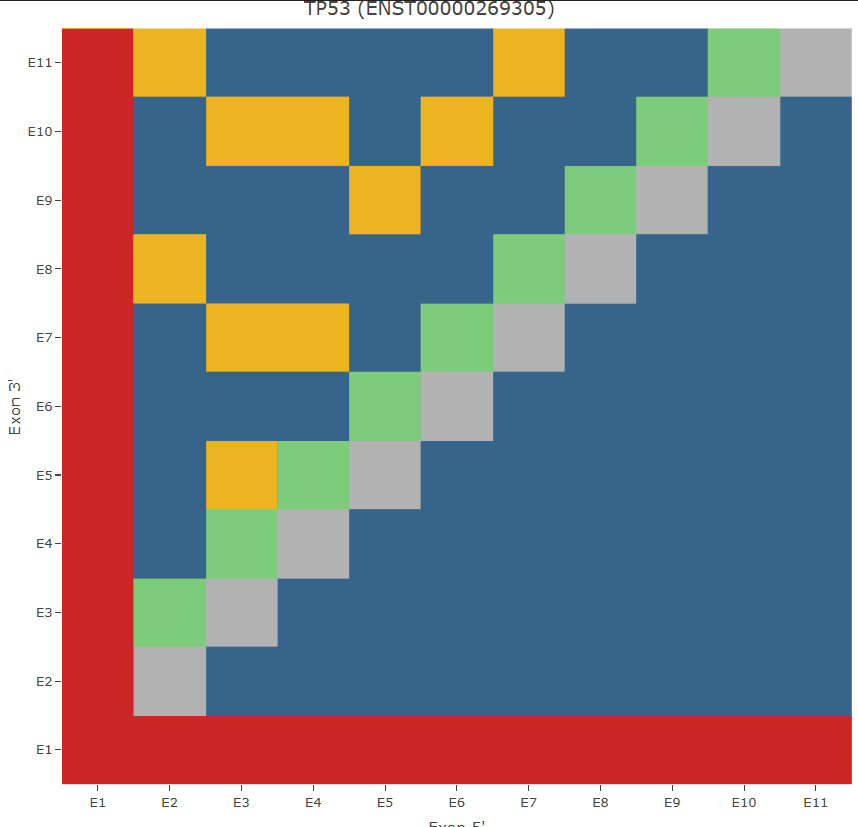
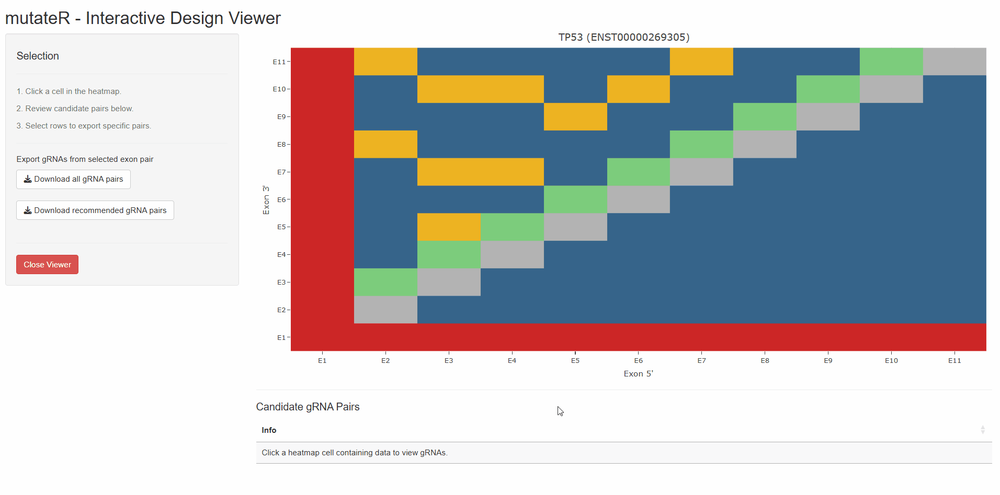

```{r setup, include = FALSE}
knitr::opts_chunk$set(
  collapse = TRUE,
  comment = "#>"
)
```


## Overview

`mutateR` streamlines design of frame-aware CRISPR/Cas-mediated deletions.

It identifies pairs of non-contiguous exons in a given transcript that are phase-compatible with each other (*i.e.*, pairs of exons that do not normally neighbour each other in the transcript, but the 5' exon ends in the same reading frame position (0, 1, or 2) as the 3' exon begins), then detects gRNAs in each exon that facilitate their deletion such that the resulting mutant allele preserves the original reading frame.

### Background

The underlying motivation is to facilitate the generation of mutant alleles that are not prone to nonsense-mediated decay (NMD), which can induce transcriptional adaptive responses ([El-Brolosy et al., *Nature* (2019)](https://doi.org/10.1038/s41586-019-1064-z "Genetic compensation triggered by mutant mRNA degradation") and [Ma et al., *Nature* (2019)](https://www.nature.com/articles/s41586-019-1057-y "PTC-bearing mRNA elicits a genetic compensation response via Upf3a and COMPASS components")). This behaviour can attenuate the phenotypic potency of mutant alleles, making the study of gene loss-of-function more difficult.

NMD is a complex process that cells use to survey and degrade transcripts that contain a premature termination codon (PTC). This generally occurs when a mutation causes a frameshift, resulting in a termination codon being introduced in a non-terminal exon. During splicing of mature mRNA, exon junction protein complexes (EJCs) are deposited at exon-exon junctions; during translation, the ribosome displaces these complexes. If a ribosome encounters a PTC **at least 50 nucleotides** upstream of the last exon-exon junction, it will fail to displace any downstream EJCs. The remaining EJC(s) will interact with termination factors to induce decay of the PTC-bearing transcript.

While the degradation of PTC-bearing mRNAs protects the cell from producing potentially toxic truncated proteins, the mRNA fragments that result from NMD can induce upregulation of other ('adapting') genes. This effect is a compensatory behaviour termed *'transcriptional adaptation'*, and can cause masking of gene loss-of-function phenotypes.

### Why does this matter?

Suppose you are studying a novel gene of interest ('A'). Gene A is expressed in the brain, and you hypothesise that loss of Gene A causes a brain growth phenotype. When you knock down expression of Gene A in your model organism of choice, you see the expected stunting of brain development; however, when you look at the brains of animals homozygous for a frameshift mutation causing a PTC early in the gene, the brains look normal. Gene A is functionally related to, and expressed in the same region as, another gene ('B'). When you measure expression of Gene A and Gene B in these brains, you see little to no Gene A expression, but Gene B is expressed at higher levels than in brains from animals that do not have this mutation. This is because Gene B has compensated for the loss of Gene A by responding to the mRNA fragments produced by NMD of the Gene A transcript. While this is *great* for the animal (it has a largely "normal" brain!), it means that we can't really use our Gene A mutant to reliably study the effects of loss of Gene A function.

**An important caveat:** Transcriptional adaptation is not universal (*i.e.*, some genes are more prone to this behaviour than others, and it is observed more frequently in some biological contexts than in others). While `mutateR` assumes that your gene of interest is prone to transcriptional adaptation when recommending gRNA pairs, you should always base your mutagenesis rationale on the requirements of your specific experimental design.

### How can we reduce the likelihood of transcriptional adaptation?

In short, **use tools for targeted mutagenesis to their strengths**. Back when the only way to make a mutant animal was to randomly mutagenise its genome and then recover alleles based on phenotypes, researchers didn't have a great deal of control over the nature of the resulting alleles. Modern sequence-targeting methods (such as CRISPR/Cas9) allow for much more control over the nature of the mutations that we can generate.

If we delete parts of a gene that correspond to functional domains of the encoded protein, but maintain the original reading frame (such that there is no PTC), we are left with a stably-expressed, truncated mutant transcript that does not encode a functional protein but also does not induce transcriptional adaptation via NMD.

> *Note*: There is nuance to NMD induction. For example, PTCs are much better tolerated (*i.e.*, do not induce NMD) if they occur in the transcript's terminal exon. For an excellent quantitative study of NMD induction relative to transcript PTC position, please see [Lindeboom, Supek and Lehner, *Nature Genetics* (2016)](https://doi.org/10.1038/ng.3664 "The rules and impact of nonsense-mediated mRNA decay in human cancers").

This type of deletion can be achieved by simultaneously targeting two sites in the gene of interest; the intervening region between the two targeted sites will be excised, and the ends of the genetic lesion are joined together by DNA repair mechanisms.

## How does `mutateR` work?

`mutateR` calls `biomaRt` to retrieve transcript and exon phase information for your gene of interest, then calculates which pairs of non-contiguous exons are phase-compatible. It then scans these exons for Cas effector PAMs (currently Cas9 NGG and Cas12a TTTV) associated with protospacers that do not cross exon boundaries.

After calculating on-target scores for potential gRNAs using rule sets from `crisprScore` ([Hoberecht et al., *Nature Communications* (2022)](https://www.nature.com/articles/s41467-022-34320-7 "A comprehensive Bioconductor ecosystem for the design of CRISPR guide RNAs across nucleases and technologies")) where possible, or by manual re-implementation of methods not available from `crisprScore`, `mutateR` performs genome-wide off-target analysis and computes per-gRNA specificity scores. It then returns recommended gRNA pairs to target exons where the flanking exons are in-frame with each other, filtering for both on-target activity and off-target specificity.

It also produces a graphical representation of the selected transcript, its phase-compatible exons, and the recommended exon pairs for targeting. Successful `mutateR` pipeline executions can be passed to the `mutateR_viewer()` function for further inspection in an interactive Shiny app.

> As of December 2025, `mutateR` utilises a Python backend (via `reticulate`) to allow for implementation of python-dependent functionalities. This was originally done to implement deep-learning-based on-target scoring methods (dependent on TensorFlow etc.) which could not be accessed by Windows OS users from `crisprScore`, but now is also required for the primer design facet of the `run_mutateR` pipeline (via `primer3-py`).
>
> As these core functionalities (and likely future ones) use the Python backend, it is **highly recommended** that all `mutateR` users install and activate the `r-mutater` Python env (containing all the requisite modules) from within `mutateR`. See the relevant Installation section ([Setting up the mutateR Python backend]) below for more information.

The `mutateR` pipeline consists of the following ordered main functions:

| Step | Function | Functionality |
|----|----|----|
| 1 | `get_gene_info()` | Query Ensembl for gene and transcript metadata. |
| 2 | `get_exon_structures()` | Retrieve exon coordinates and phase metadata. |
| 3 | `find_cas9_sites()`/`find_cas12a_sites()` | Identify nuclease recognition sites. |
| 4 | `check_exon_phase()` | Determine phase-compatible exon pairs. |
| 5 | `check_frameshift_ptc()` | Calculate and flag frameshift/PTC consequences. |
| 6 | `map_protein_domains()` | Retrieve protein domain annotations from InterPro corresponding to exons. |
| 7 | `score_grnas()` | On-target scoring with a specified method (see [gRNA scoring]). |
| 8 | `score_offtargets()` | Genome-wide off-target specificity scoring (see [Off-target scoring]). |
| 9 | `filter_valid_grnas()` and `assemble_grna_pairs()` | Filter allowed gRNA pairs and assemble into a readable data.frame. |
| 10 | `plot_grna_design()` | Visualise phase compatibility of non-contiguous exon pairs and top-ranked valid gRNA pairs. |
| 11 | `plot_grna_heatmap()` | Helper function for `plot_grna_design()` but can be executed separately. |
| 12 | `plot_grna_interactive()` | Helper function for interactive plotting mode. |
| 13 | `run_mutateR()` | Wrapper; runs entire pipeline. |
| 14 | `mutateR_viewer()` | Launches a Shiny app for gRNA extraction from an interactive heatmap. |

> Note: In `hybrid` off-target mode, `refine_with_bulges()` runs as an additional refinement step after pair assembly (Step 9), updating specificity scores for recommended gRNA pairs using CRISPRitz bulge search before visualisation.

`mutateR` also has an additional function, `design_grna_pairs()`, that is not included in the wrapper function. This function can be used in isolation to produce a data.frame of gRNA pairs for the gene of interest. Other scripts such as `deep_learning_utils.R`, `python_env.R`, `primer3-backend.R` and `design_primers.R` contain helper functions that are critical but not directly user-executed pipeline components.

## Getting started

### Installation

Currently, `mutateR` can be installed from GitHub:

```{r install, eval=FALSE}
devtools::install_github("amdouek/mutateR")
library(mutateR)
```

Running `mutateR` requires only installation of the package itself, and that you have also installed the `BSgenome` R package for your species of interest (*e.g.*, `BSgenome.Hsapiens.UCSC.hg38` for human). These BSgenome data packages can be quite large, so are not installed alongside `mutateR`.

> For convenience's sake, here are the Bioconductor pages to install the genomes for commonly-used species:
>
> -   [human (hg38)](https://doi.org/doi:10.18129/B9.bioc.BSgenome.Hsapiens.UCSC.hg38),
>
> -   [mouse (mm10)](https://doi.org/doi:10.18129/B9.bioc.BSgenome.Mmusculus.UCSC.mm10),
>
> -   [rat (rn7)](https://doi.org/doi:10.18129/B9.bioc.BSgenome.Rnorvegicus.UCSC.rn7),
>
> -   [zebrafish (danRer11)](https://doi.org/doi:10.18129/B9.bioc.BSgenome.Drerio.UCSC.danRer11),
>
> -   [*Drosophila melanogaster* (dm6)](https://doi.org/doi:10.18129/B9.bioc.BSgenome.Dmelanogaster.UCSC.dm6)
>
> -   [*Caenorhabditis elegans* (ce11)](https://bioconductor.org/packages/release/data/annotation/html/BSgenome.Celegans.UCSC.ce11.html)
>
> You can also see all genomes currently available through `BSgenome` by running `BSgenome::available.genomes()`.

#### Off-target scoring dependencies

Off-target scoring with the default **Bowtie backend** requires three additional Bioconductor packages: `crisprBowtie`, `Rbowtie`, and `crisprBase`. These are listed in `Suggests` and will produce an informative error message if missing when off-target scoring is first invoked. Install them with:

```{r, eval=FALSE}
BiocManager::install(c("crisprBowtie", "Rbowtie", "crisprBase"))
```

The first off-target run also triggers a one-time Bowtie index build for your genome (\~10-15 minutes for hg38, \~2.5 GB disk). This is cached persistently and reused in all future sessions.

> **Important**: The CRISPRitz backend (experimental) has additional requirements - see [CRISPRitz backend (experimental)](#crispritz-backend-experimental) for details.

### Setting up the `mutateR` Python backend

In order to use the full suite of functionalities in `mutateR` (*e.g.*, automated genotyping primer design, all gRNA on-target scoring methods), you must install and activate the package's Conda environment. This env contains all the necessary dependencies for Python-reliant package functions.

#### Install `reticulate`

`reticulate` is the [R interface to Python](https://rstudio.github.io/reticulate/) required to run `mutateR` as intended. You can install it from CRAN if needed, but it is imported upon installation of `mutateR`.

#### Install the `r-mutater` Python env

Installing the Python backend is simple: In R, after installing and loading the `mutateR` package, simply run the command `install_mutater_env()`.

> If you have never used Python before, it likely does not yet exist on your device. If this is the case, and you are running `mutateR` for the first time, this command will install [Miniconda](https://www.anaconda.com/docs/getting-started/miniconda/main) via `reticulate`. This might take a few minutes - ensure it completes fully before proceeding.

This command will create an env called `r-mutater` with the specified `python_version` containing the following dependencies: `"tensorflow-cpu==2.15.0", "numpy<2", "h5py", "pandas", "scipy", "primer3-py", "rs3", "scikit-learn", "biopython", "viennarna"`.

If for whatever reason the env has not been installed correctly (or if a new dependency has been added since you last installed the package), rerun the installation with the parameter `fresh = TRUE` to remove and reinstall the env.

**Important:** Restart your R session (Ctrl/Cmd + Shift + F10) after installation is complete.

#### Activate the env

After **restarting your R session**, run `activate_mutater_env()` to point your R session to the `r-mutater` env. `reticulate`'s default env is `RETICULATE_PYTHON`; `activate_mutater_env()` will unset this and set it as `r-mutater`. This will only last for the current R session and will revert to the default upon session restart (*i.e.*, you will need to reactivate the env each time you initiate a new session, but you will only need to *reinstall* the env if a new dependency is added or if it is corrupted).

Once the env is successfully activated, `[1] TRUE` will be printed in the console. At this point, you will be able to make use of the full suite of `mutateR` functionalities.

## The `mutateR` workflow

In the below example run, we will run `mutateR` on human *TP53* to select optimal Cas9 gRNA pairs. Assuming you have installed both `mutateR` and your BSgenome of choice (in this case, human), and set up the Python backend correctly:

```{r, message=FALSE}
library(reticulate)
library(mutateR)
library(BSgenome.Hsapiens.UCSC.hg38)

activate_mutater_env()
```

The wrapper function `run_mutateR()` executes the full pipeline (using the canonical transcript by default). For human *TP53:*

```{r}
tp53_res <- run_mutateR(
  gene_id = "TP53",
  species = "hsapiens",
  genome = BSgenome.Hsapiens.UCSC.hg38,
  nuclease = "Cas9",
  score_method = 'ruleset1',
  design_primers = TRUE,
  offtarget = FALSE,
  quiet = FALSE,
  plot_mode = 'heat'
  )
```

> In this example, off-target scoring is disabled (`offtarget = FALSE`) for speed. When enabled (which it is by default), `run_mutateR()` performs genome-wide off-target analysis using the Bowtie backend, typically completing in under a minute for hundreds of guides **once the one-time index build is cached**. See [Off-target scoring] for full details on backends and configuration.

> Note that this function also reports a PAM distribution. In the case of *TP53*, CGG PAMs are significantly underrepresented amongst those identified by `mutateR`, as is generally expected in the human exome (see [Yang, Zhu and Jin, *BMC Genomics* (2024)](https://bmcgenomics.biomedcentral.com/articles/10.1186/s12864-024-11073-9) and [Scott and Zhang, *Nature Medicine* (2017)](https://pmc.ncbi.nlm.nih.gov/articles/PMC5749234/)).

The object `tp53_res` is a list with the following levels:

```{r}
names(tp53_res)
```

With the actual selected gRNA pairs (with associated metadata) stashed as a data.frame in `tp53_res$pairs`.

```{r}
kableExtra::scroll_box(knitr::kable(head(tp53_res$pairs,5)),width = '700px')
```

By default, all pairs are present in this data.frame; if you are interested in only those that `mutateR` recommends, simply filter for `recommended == TRUE`.

```{r}
tp53_recommended <- filter(tp53_res$pairs, tp53_res$pairs$recommended == TRUE)
kableExtra::scroll_box(knitr::kable(head(tp53_recommended,5)),width = '700px')
```

### Interpreting the `run_mutateR()` output

#### The `pairs` data.frame

`$pairs` contains several columns - some of these are not strictly useful for the end-user (*e.g.* genomic coordinates), but most represent the primary output of the pipeline. The below sections will elaborate on these:

##### Flanking and targeted exons

`upstream_exon` and `downstream_exon` refer to the two phase-compatible exons, while `exon_5p` and `exon_3p` refer to the 5-prime and 3-prime exons to simultaneously target using the selected gRNAs in that row of the data.frame.

##### Pair classification flags

Each gRNA pair is annotated by several classifications. The `compatible` flag (`run_mutateR()` currently only returns compatible exon pairs) highlights if the exon pair is phase-compatible; if a non-compatible exon pair were used, one might expect the `frameshift` and `ptc_flag` values to be `TRUE`. The `terminal_exon_case` flag is used for a special case, where a frameshift has introduced a PTC into the terminal exon of the selected transcript. Final-exon PTCs induce NMD with far lower efficiency than those in non-terminal exons, and are significantly less likely to result in transcriptional adaptive behaviour.

##### gRNA pairs and associated deletion sizes

The actual gRNA protospacer sequences are given in `protospacer_sequence_5p` and `protospacer_sequence_3p` (with 5p and 3p referring to the relative position in the transcript of the gRNAs in the given pair), and the corresponding PAMs in `pam_sequence_5p` and `pam_sequence_3p` respectively.

> Note that while both + and - strands are scanned for PAMs, the - strand sequences are automatically reverse-complemented so will always display NGG PAMs (instead of CCN).

For each gRNA pair, the expected deletion size at both the genomic and transcript level is reported in `genomic_deletion_size` and `transcript_deletion_size`, respectively.

##### Genotyping primers and amplicon sizes

`run_mutateR()` now also automatically generates a pair (or two pairs, depending on the nature of the deletion - see [A note on primer design]) of primers for genotyping the resulting deletion produced by the gRNA targeting. `priming_strategy` reports the genotyping approach used (either 'Flanking' [one primer pair] or 'Dual Pair' [two primer pairs]); `primer_ext_fwd` and `primer_ext_rev` for the deletion-flanking primer sequences, and `primer_int_fwd` and `primer_int_rev` for primer pair sequences nested within the deleted region (Dual Pair only). `exp_wt_size` reports the expected wild type amplicon size, and `exp_mut_size` the expected mutant amplicon size from the flanking primers. `exp_int_size` reports the amplicon size for the nested (internal) primer pair.

##### gRNA scoring

The currently implemented scoring methods are `"ruleset1"`, `"ruleset3"`, `"deephf"`, and `"deepspcas9"` for Cas9, and `"deepcpf1"` and `"enpamgb"`, for Cas12a.

`ruleset1` is implemented via `crisprScore` and works in an R-only environment, but the others require activation of the `r-mutater` Python env. **While `crisprScore` itself has implemented all of the above methods, it has only done so for macOS and Linux systems - I have reimplemented them here for Windows users as well.**

The weights for the deep learning-based methods can be found in `inst/extdata`. Please note that in the context of `mutateR`, `deepcpf1` refers to the [Seq-DeepCpf1](https://www.nature.com/articles/nbt.4061) model (sequence-only, without training on chromatin accessibility information).

> Please also note that the authors of [DeepSpCas9](https://www.science.org/doi/10.1126/sciadv.aax9249) provided the training data (as TensorFlow checkpoint files) rather than as explicit weights. I have attempted to reconstruct the weights based on the model topology reported in the paper, and while it seems to be reporting values within the range expected, these scores should be treated with caution until I can do some more validation that my weights are equivalent to the ones used by the authors.

Each 5-prime and 3-prime gRNA sequence also has corresponding `ontarget_score` relating to whatever scoring method you selected when executing `run_mutateR()`. Note that the nature of the score will differ between methods (*e.g.*, `"ruleset1"` reports a probability value between 0-1, while `"deepspcas9"` reports a scalar linear regression value (usually 0-100, occasionally negative).

##### Off-target specificity

When off-target scoring is enabled (the default), each gRNA pair also carries specificity metadata:

-   `specificity_score_5p` and `specificity_score_3p` report the per-gRNA MIT-style specificity score (0–100 scale). A score of 100 means no off-target hits were found; lower values indicate increasing off-target risk. These are computed from the aggregate CFD (Cutting Frequency Determination) scores of all genome-wide off-target hits ([Hsu et al., *Nature Biotechnology* (2013)](https://doi.org/10.1038/nbt.2647)).

-   `pair_specificity` is the combined pair-level specificity, reflecting the fact that in a two-guide deletion experiment, off-target damage from each gRNA is independent and additive. This score accounts for the total off-target burden from *both* guides and is more informative than simply taking the minimum of the two individual scores.

-   `n_offtargets_5p` and `n_offtargets_3p` report the number of off-target hits with meaningful CFD scores (\> 0.01) for each gRNA.

When off-target scoring was not performed (`offtarget = FALSE`) or a backend failure occurred, these columns will contain `NA` values. Guides that were identified as repeat-rich (*e.g.*, targeting Alu/SINE elements) and quarantined during CRISPRitz analysis receive a specificity score of 0.

##### Other

`domains` contains protein domain annotations corresponding to the region to be deleted derived from the `map_protein_domains()` function. The `recommended` flag is `TRUE` if the gRNA pair meets all validity criteria: Both gRNAs must pass the on-target scoring threshold, and the pair must meet the minimum pair specificity threshold (`min_pair_specificity`, default `10`) when off-target scoring is enabled. Pairs where off-target scoring was unavailable (`NA` specificity) are given the benefit of the doubt and are not penalised. Importantly, genotyping primers are only generated for recommended gRNA pairs.

#### Visualisation

##### Static visualisation modes

`mutateR` also produces a basic visualisation for exon phase-compatibility, by default a heatmap.

```{r mutateR_plot_heatmap, fig.width=10, fig.height=8}
tp53_res$plot
```

The x-axis represents the 5-prime exon, and the y-axis the three-prime exon, to represent a given exon pair. UTR-containing exons are in red, contiguous exons in green, while non-contiguous phase-compatible exons are in yellow. All incompatible exon pairs are blue.

Domain annotations from Pfam are provided in a secondary plot element below the heatmap x-axis to assist you in selecting regions should you wish to ablate specific functional domains.

The partially deprecated arc-based plotting mode can be accessed by specifying `"arc"` in the `plot_mode` parameter in `run_mutateR()`. It will remain, for now, the default plotting mode for small-gene edge cases (described below).

This visualisation mode might be refined in future (if I feel like it), but presently I will be focusing my effort on improving the heatmap.

```{r mutateR_plot_arc, fig.width=10, fig.height=8}
tp53_arc <- run_mutateR(
  gene_id = "TP53",
  species = "hsapiens",
  genome = BSgenome.Hsapiens.UCSC.hg38,
  nuclease = "Cas9",
  score_method = 'ruleset1',
  offtarget = FALSE,
  design_primers = FALSE,
  top_n = NULL,
  quiet = TRUE,
  plot_mode = 'arc'
  )

tp53_arc$plot
```

##### Interactive visualisation modes

`mutateR` now offers an interactive heatmap plotting mode which can be evoked by specifying `interactive = TRUE` inside `run_mutateR()`. Hovering over a cell in the heatmap will report metadata for that exon pair in a tooltip (*e.g.*, whether the exon pair is (in)compatible, how many gRNA pairs exist for that exon pair, etc.). This visualisation mode is used as the basis for the much more useful `mutateR_viewer` Shiny app (see below).

```{r mutateR_interactive_heat, eval=FALSE, fig.height=8, fig.width=10, message=FALSE, warning=FALSE, include=FALSE}

tp53_heat_int <- run_mutateR(
  gene_id = "TP53",
  species = "hsapiens",
  genome = BSgenome.Hsapiens.UCSC.hg38,
  nuclease = "Cas9",
  score_method = 'ruleset1',
  top_n = NULL,
  quiet = TRUE,
  plot_mode = 'heat',
  interactive = TRUE
)

tp53_heat_int$plot
```



#### Other data levels

The `run_mutateR()` output also contains two GRanges objects: `exons` and `scored_grnas`.

`exons` contains the exon metadata (coordinates, strand, phase, length, etc.):

```{r}
head(tp53_res$exons,5)
```

`scored_grnas` contains the complete set of (unpaired) gRNAs, their genomic coordinates, and the on-target score. When off-target scoring is enabled, each gRNA also carries `specificity_score` (MIT-style, 0-100), `n_offtargets` (hit count with CFD \>0.01), and `has_exonic_offtarget` (whether any exonic off-target has CFD \>0.1). The `sequence_context` column is the protospacer + PAM as well as the flanking nucleotides required for scoring (according to `crisprScore::scoringMethodsInfo`) based on the selected scoring method.

```{r}
head(tp53_res$scored_grnas,5)
```

### A note on primer design

The primer design component of the `mutateR` pipeline relies on the `primer3-py` module accessed via the Python backend, and requires the correct installation and activation of the `r-mutater` env.

This functionality applies two different primer design strategies depending on the expected size of the deletion evoked by a given gRNA pair:

-   **Strategy A** is a simple, single primer pair approach used for when the wild type amplicon would be \< 3 kb. The forward and reverse primers are positioned slightly distal to the deletion sites, producing a large wild type amplicon and a small mutant one.

-   **Strategy B** is a two-pair approach used for very large deletions (where the wild type amplicon size using Strategy A primers would be unreasonably large). The first pair flanks the deletion site, but will only produce an amplicon when the deletion is present (proximalising the primer binding sites). The second primer pair (nested within the deleted region) is used to distinguish wild type and heterozygous genotypes from homozygous ones.

The following parameters are the ones passed to `primer3-py`:

```{python,eval=FALSE}
base_global_args = {
        'PRIMER_OPT_SIZE': 20,
        'PRIMER_MIN_SIZE': 18,
        'PRIMER_MAX_SIZE': 25,
        'PRIMER_MIN_GC': 40.0,
        'PRIMER_MAX_GC': 65.0,
        'PRIMER_MAX_POLY_X': 4,       # Disallows homopolymers >4 nts
        'PRIMER_GC_CLAMP': 1,         # Weighted preference for 3' GC clamp
        'PRIMER_MAX_SELF_ANY': 8.00,
        'PRIMER_MAX_SELF_END': 3.00,
        'PRIMER_MAX_NS_ACCEPTED': 0,
        'PRIMER_NUM_RETURN': 1
    }
```

These are not user-facing (changing them requires modification of the source code). However, the user can adjust the parameters `primer_max_wt` (the wild type amplicon size cutoff [in nucleotides] before Strategy B is evoked, default `3000`) and `primer_tm` (the target primer T~m~, default `60.0`) in `run_mutateR()`.

In order to significantly speed up the primer design process, I have applied vectorisation to batch-pass the designed primers between R and the Python backend.

### Off-target scoring

A gRNA that efficiently cuts its intended target is only useful if it doesn't also cut elsewhere in the genome. This is especially important for `mutateR`'s dual-gRNA deletion strategy: Each experiment involves *two* guides acting simultaneously, so the total off-target risk is the combined burden of both. A pair of individually "okay" guides can be collectively risky.

`mutateR` attempts to address this by performing a genome-wide off-target search, scoring each hit using the CFD (Cutting Frequency Determination) method ([Hsu et al., *Nature Biotechnology* (2013)](https://doi.org/10.1038/nbt.2647)), and aggregating the results into a per-gRNA MIT-style specificity score (0-100). These individual scores are then combined into a pair-level specificity score that reflects the additive off-target burden of both guides. Only pairs above the `min_pair_specificity` threshold (default 10) are recommended in the pipeline output.

Off-target scoring is **enabled by default** in `run_mutateR()` and can be disabled with `offtarget = FALSE` for fast prototyping runs (or if you don't care about off-target activity for whatever reason).

#### Backends

`mutateR` provides three off-target search backends. In most cases, the default Bowtie backend is all you need.

| Backend | Speed | Sensitivity | Dependencies | Recommended for |
|----|----|----|----|----|
| `bowtie` (default) | \<1 min for \~400 guides at 3 mismatches | Mismatch-only (up to 3mm) | `crisprBowtie`, `Rbowtie`, `crisprBase` (Bioconductor) | Most users; standard desktop analysis |
| `hybrid` | \<1 min Phase 1 + variable Phase 2 | Mismatch (all guides) + bulge refinement (recommended pairs only) | Above + CRISPRitz CLI (conda/WSL) | Users wanting bulge sensitivity on final selections |
| `crispritz` | \~15s per guide (indexed, bMax=1) | Mismatch + DNA/RNA bulges (all guides) | CRISPRitz CLI (conda/WSL) | HPC / advanced users; comprehensive analysis |

**Bowtie** performs fast mismatch-only alignment via `crisprBowtie` / `Rbowtie`. It supports up to 3 mismatches (Bowtie's hard limit) and searches only canonical PAMs by default (matching the MIT specificity calibration). This is the workhorse backend and handles the vast majority of use cases with negligible runtime (once the genome index has been prebuilt, see [Cache and genome index management]).

**Hybrid** mode runs Bowtie Phase 1 on all guides (fast), then selectively refines only the guides present in recommended pairs using CRISPRitz with bulge detection (Phase 2). This gives you bulge detection on the guides you'll practically select without paying the CRISPRitz cost for every guide. If CRISPRitz is not available, hybrid mode falls back gracefully to Bowtie-only scores.

**CRISPRitz** is a (currently experimental) reimplementation (including for Windows users via WSL) of the off-target scoring facet of the Pinello lab's [CRISPRitz](https://github.com/pinellolab/CRISPRitz) tool ([Cancellieri et al., *Bioinformatics* (2020)](https://pubmed.ncbi.nlm.nih.gov/31764961/)). This mode runs a single-pass indexed search on all guides, capturing both mismatch and bulge off-targets. It is significantly slower and more memory-intensive than Bowtie on Windows systems (via WSL), but provides the most comprehensive off-target landscape. See [CRISPRitz backend (experimental)](#0){style="font-size: 11pt;"} for important notes and usage caveats.

#### Usage

```{r, eval=FALSE}
library(BSgenome.Hsapiens.UCSC.hg38)

# Default: Bowtie mismatch-only (recommended for most users)
result <- run_mutateR(
  gene_id = "TP53",
  species = "hsapiens",
  genome = BSgenome.Hsapiens.UCSC.hg38,
  nuclease = "Cas9"
  # ot_backend = "bowtie" is the default
)

# Hybrid: Bowtie + CRISPRitz bulge refinement on recommended pairs
result <- run_mutateR(
  gene_id = "TP53",
  species = "hsapiens",
  genome = BSgenome.Hsapiens.UCSC.hg38,
  nuclease = "Cas9",
  ot_backend = "hybrid"
)

# Skip off-target scoring (fast prototyping)
result <- run_mutateR(
  gene_id = "TP53",
  species = "hsapiens",
  genome = BSgenome.Hsapiens.UCSC.hg38,
  nuclease = "Cas9",
  offtarget = FALSE
)
```

Key parameters for off-target scoring in `run_mutateR()`:

| Parameter | Default | Description |
|----|----|----|
| `offtarget` | `TRUE` | Master switch for off-target analysis. |
| `ot_backend` | `"bowtie"` | Search backend (`"bowtie"`, `"hybrid"`, or `"crispritz"`). |
| `max_mismatches` | `3` | Maximum mismatches (clamped to 3 for Bowtie). |
| `min_pair_specificity` | `10` | Minimum pair specificity for recommended status. |
| `ot_detail_level` | `"compact"` | How much hit detail to retain (`"compact"`, `"full"`, `"file"`, `"none"`). |
| `max_dna_bulges` | `2` | Maximum DNA bulge size (CRISPRitz/hybrid only). |
| `max_rna_bulges` | `2` | Maximum RNA bulge size (CRISPRitz/hybrid only). |
| `ot_canonical_only` | `TRUE` | Search canonical PAMs only (Bowtie/hybrid). |

See `?score_offtargets` for the full parameter documentation.

#### Understanding pair specificity

For a single gRNA, the MIT specificity score summarises genome-wide off-target risk as:

$$
\text{Specificity} = \frac{100}{1 + \sum_i \text{CFD}_i}
$$

where the sum is over all off-target hits (excluding the on-target site). A score of 100 means zero off-target burden; lower values mean more predicted off-target activity.

For a two-guide experiment, off-target damage from each gRNA is assumed to be independent and additive (please contact me if you have evidence to the contrary!). `mutateR` computes a pair specificity that reflects this combined burden in the following manner:

1.  **Per-guide off-target burden.** Rearranging the specificity formula gives the off-target burden $S$ — the total CFD-weighted off-target activity relative to the on-target cut:

$$
S = \frac{100}{\text{Specificity}} - 1
$$

A guide with specificity 100 has $S = 0$ (no off-target burden); a guide with specificity 50 has $S = 1$ (off-target activity equal to on-target activity).

2.  **Pair burden.** Since each guide cuts independently, the total off-target burden is additive:

$$
S_{\text{pair}} = S_{5p} + S_{3p}
$$

3.  **Pair specificity.** Substituting the pair burden back into the specificity formula:

$$
\text{Specificity}_{\text{pair}} = \frac{100}{1 + S_{\text{pair}}} = \frac{100}{1 + \left(\frac{100}{\text{Spec}_{5p}} - 1\right) + \left(\frac{100}{\text{Spec}_{3p}} - 1\right)} = \frac{100}{\frac{100}{\text{Spec}_{5p}} + \frac{100}{\text{Spec}_{3p}} - 1}
$$

This has two useful properties:

-   It is **more stringent than the minimum** for balanced pairs. Two guides each with specificity 50 yield a pair specificity of 33.3 (not 50), correctly reflecting the doubled off-target burden.

-   It is **more lenient than the minimum** for asymmetric pairs. A weak guide (specificity 45) paired with a strong guide (specificity 90) yields 42.9, correctly crediting the strong partner's minimal contribution to total risk burden.

| Guide A | Guide B | Pair specificity | Interpretation                        |
|---------|---------|------------------|---------------------------------------|
| 90      | 90      | 81.8             | Two highly specific guides            |
| 50      | 50      | 33.3             | Each guide doubles the total burden   |
| 45      | 90      | 42.9             | Strong partner partially compensates  |
| 30      | 30      | 17.6             | Both mediocre — combined risk is high |

The formula also implies an absolute individual specificity floor. Consider the best possible case: one guide is perfect ($\text{Specificity} = 100$, $S = 0$). The pair specificity then reduces to:

$$
\text{Specificity}_{\text{pair}} = \frac{100}{1 + S_{\text{other}} + 0} = \frac{100}{\frac{100}{\text{Spec}_{\text{other}}}} = \text{Spec}_{\text{other}}
$$

That is, even with a perfect partner, the pair specificity cannot exceed the weaker guide's individual specificity. A `min_pair_specificity` threshold of $T$ therefore requires *every* guide in the pair to have individual specificity $\geq T$, regardless of partner guide quality.

As a consequence of this, the default threshold (`min_pair_specificity = 10`) is deliberately permissive; it flags only the most problematic pairs (otherwise my empirical observation is that you almost never get any accepted guide pairs). You can increase this for more stringent filtering if you wish.

#### Cache and genome index management

The first time you run off-target scoring for a given genome, `mutateR` performs two one-time setup steps:

1.  **Genome FASTA export:** Extracts standard chromosomes from your BSgenome object to per-chromosome FASTA files (this is a requirement for CRISPRitz, 2.91 Gb for hg38).
2.  **Bowtie index build:** Constructs a Bowtie index from these FASTA files (\~10-15 minutes and 2.93 Gb for hg38).

Both are cached persistently in `tools::R_user_dir("mutateR", "cache")` and reused across R sessions. Subsequent off-target runs start searching immediately.

Approximate disk usage for hg38 (haven't yet checked expense for other genomes):

| Component | Size | When created |
|----|----|----|
| Genome FASTA cache | 2.91 GB | First off-target run (any backend) |
| Bowtie index | 2.93 GB | First Bowtie/hybrid run |
| CRISPRitz TST index (bMax=1) | \~6.5 GB (varies depending on `bMax`) | First CRISPRitz/hybrid run |

#### Interpreting off-target output

When off-target scoring is enabled, the `run_mutateR()` output includes:

**In `$pairs`:** Per-pair specificity columns (`specificity_score_5p`, `specificity_score_3p`, `pair_specificity`, `n_offtargets_5p`, `n_offtargets_3p`) and updated `recommended` flags incorporating the pair specificity threshold.

**In `$scored_grnas`:** Per-gRNA columns (`specificity_score`, `n_offtargets`, `has_exonic_offtarget`) attached to the GRanges metadata.

**As attributes:** Off-target hit details (filtered per `ot_detail_level`) are available via `attr(result$scored_grnas, "offtarget_details")`. When `ot_detail_level = "file"`, the full unfiltered details are written to a compressed RDS file whose path is stored in `result$offtarget_details_path`.

**At the top level:** `result$ot_backend` records which backend was used; `result$ot_detail_level` records the detail level setting.

#### CRISPRitz backend (experimental) {#crispritz-backend-experimental}

> **Important:** The CRISPRitz backend is a highly experimental feature and is **strongly NOT recommended for local/desktop production use.** It works, and I've invested significant effort in adapting it for use in WSL, but it remains fundamentally memory-intensive and slow relative to Bowtie. It is included in `mutateR` for users with access to HPC environments (though I haven't yet tested it on an HPC cluster) or specific research needs requiring bulge-aware off-target detection. For the vast majority of use cases, the default Bowtie backend (and the hybrid approach) is sufficient and vastly more practical.

##### What it adds

The Bowtie backend detects only mismatch-based off-targets (*i.e.*, sites where the gRNA aligns to the genome with nucleotide substitutions). CRISPRitz ([Cancellieri et al., *Bioinformatics* (2020)](https://doi.org/10.1093/bioinformatics/btz867)) additionally detects **DNA and RNA bulge** off-targets, where insertions or deletions in the alignment create single-nucleotide bulges. Some biologically validated off-target sites involve bulges rather than (or in addition to) mismatches, so bulge-aware searching provides a more complete off-target landscape.

##### Why it's experimental

-   **Speed:** Based on my local testing, CRISPRitz indexed search runs at approximately 15 seconds per guide (bMax=1, 3-4 threads, hg38). For a gene like *TP53* with \~400 guides, a full CRISPRitz run (without problematic guides, see below) takes \>100 minutes.

-   **Memory:** Each CRISPRitz thread loads a full copy of the TST (Ternary Search Tree) index into memory (\~1.5-2 GB per thread for hg38 at bMax=1). With 3-4 threads, CRISPRitz alone requires 5-8 GB of RAM before accounting for R's own memory footprint.

-   **Repeat-rich guides:** Guides derived from repetitive elements (Alu SINEs, LINE-SINE junctions, etc.) match tens of millions of genomic loci. CRISPRitz accumulates all hits in memory without bounds, which can exhaust physical RAM and trigger OOM kills. I've attempted to account for this in `mutateR` by including pre-screening (linguistic complexity analysis) and reactive quarantine logic (single-guide probing with automatic isolation of toxic guides), but edge cases may still cause crashes in memory-constrained environments. This remains an active area of development (when I can get around to it).

-   **bMax=2 is effectively unusable locally in batch mode:** At bMax=2, CRISPRitz search time increases \~22-fold per guide (\~18 min/guide), and multi-guide batches reliably cause OOM crashes. I've configured `mutateR` so that it caps bulge depth at bMax=1 for batched search unless `full_bulge_scan = TRUE` is explicitly set, and even then triggers sequential single-guide fallback. I intend to stress-test this on an HPC system with as many threads as I can throw at it, but the bMax=1 cap is deliberate and *should not* be changed for now (or do so at your own risk).

##### Windows users: CRISPRitz via WSL

`mutateR` is - to my knowledge, and apologies to the Pinello lab if not - unique in supporting CRISPRitz execution on Windows via the Windows Subsystem for Linux (WSL) (Note: The full CRISPRitz tool can be run on Windows via Docker - see <https://github.com/pinellolab/CRISPRitz> - but I am only attempting to adapt its off-target scoring elements in `mutateR` rather than the entire tool).

The package automatically handles Windows\<-\>WSL path translation, one-time index copying to the WSL-native filesystem (for dramatically faster I/O), and inter-batch memory reclamation.

To set up CRISPRitz for Windows:

1.  Ensure [WSL2](https://learn.microsoft.com/en-us/windows/wsl/install) is installed with a Linux distribution (*e.g.* Ubuntu).

2.  Open a WSL terminal and create a conda environment:

    ```{bash, eval=FALSE}
    conda create -n r-mutater-wsl python=3.9
    conda install -n r-mutater-wsl -c bioconda -c conda-forge crispritz
    ```

3.  `mutateR` detects the WSL environment automatically.

> **WSL memory:** WSL2 runs inside a Hyper-V VM with a default memory ceiling (typically 50% of host RAM). For CRISPRitz, we recommend configuring at least 16 GB via `%UserProfile%\.wslconfig`:
>
> ```         
> [wsl2]
> memory=16GB
> ```

##### Recommendation

For desktop/laptop analysis, use the **Bowtie** backend (default) or **hybrid** mode (which only invokes CRISPRitz on the small subset of recommended-pair guides). Reserve the standalone **CRISPRitz** backend for HPC environments with high RAM availability, or for targeted single-gene analyses where you specifically need bulge-aware off-target detection.

A note on the hybrid approach: This applies filtering on already filtered guides - my empirical observation across multiple genes is that Phase 2 bulge detection tends to leave you with 0 recommended guides. Hence, Bowtie remains the default and the recommended approach.

#### Scoring methodology

For transparency, the following is how `mutateR` scores and aggregates off-target hits:

-   **CFD scoring (Cas9 mismatch hits):** Each off-target alignment is scored using the Cutting Frequency Determination position-weight matrix from [Hsu et al. (2013)](https://doi.org/10.1038/nbt.2647), accessed via `crisprScore::getCFDScores()`. The CFD score (0-1) reflects the predicted cutting activity at that off-target site relative to a perfect match.

-   **Bulge hits:** For alignments containing DNA or RNA bulges, the CFD score is computed on the aligned (length-matched) portion of the sequences, then multiplied by a bulge penalty: $\text{CFD} \times \text{bulge penalty}^\text{bulge size}$ (default `bulge_penalty = 0.2`). This assumes each nucleotide of bulge substantially reduces cutting efficiency.

-   **Non-Cas9 nucleases:** The Hsu CFD matrix is Cas9-specific. For Cas12a and enCas12a, `mutateR` uses a simple mismatch-count heuristic ($0.5^{\text{mismatches}}$) as a placeholder. Dedicated Cas12a off-target scoring matrices may be integrated in future (assuming someone is working on this problem - it's kind of beyond my remit). I am aware of <https://pmc.ncbi.nlm.nih.gov/articles/PMC10581463/> and will check it and other literature for suitability when I can.

-   **MIT specificity aggregation:** Per-gRNA specificity is computed as $\frac{100}{(1 + \Sigma{CFD})}$ across all off-target hits, where the on-target site (identified by a ±10 bp positional window) is excluded.

-   **On-target exclusion:** Hits within 10 bp of the gRNA's own cut site on the same chromosome are classified as on-target and excluded from the off-target CFD sum.

-   **Exonic annotation:** Off-target hits are intersected with the input exon coordinates. Guides with any exonic off-target hit having CFD \> 0.1 are flagged via `has_exonic_offtarget`.

### Special cases

#### When the same exon is targeted twice

In certain cases, both gRNAs in a pair will target the same exon (*e.g.*, if two phase-compatible exons are separated by a single exon, such that the intervening exon is to be removed). In these cases, specific rules need to be applied in order to prevent the generation of small deletions that would likely cause the retention of a frameshifted exon remnant in the mature mRNA, and a consequent PTC.

To account for these, I have applied the following filters during gRNA pair assembly for pairs where both gRNAs target the same exon:

-   Do not recommend gRNA pairs that would be expected to cause a deletion of \<50 bp (small deletions can be annoying to genotype, can cause frameshifted exon retention + PTC, and if gRNAs target loci too close to each other they can cause steric hindrance between Cas RNPs, thereby preventing the required simultaneous DSBs).

-   Only recommend gRNA pairs that would result in removal of \>70% of the original exon mass **OR** if the residual exon fragment is \<50 nt.

    -   We calculate the residual exon mass (REM) by subtracting the expected genomic deletion size from the exon length, then determine a deletion ratio by dividing the deletion size by the exon length.

    -   Removal of a large portion of the exon will increase the likelihood of removing important exonic splicing enhancers (ESEs), which will lead to the exclusion of the remaining exon fragment.

    -   Residual exon fragments \<50 bp in length are frequently excluded by the spliceosome during mature mRNA assembly (see [Hwang and Cohen, MCB (1997)](https://www.tandfonline.com/doi/abs/10.1128/MCB.17.12.7099)).

#### Small genes

Given that NMD induction requires persistence of EJCs, genes with one or two exons tend to not be quite as prone to this mode of transcriptional adaptive response. However, we still want these types of genes to be able to be handled by `mutateR`, which will automatically recognise these edge cases if you provide such a gene (or a specific transcript with only 1-2 exons).

Instead of computing exon phase compatibility (which isn't a factor for these types of gene), the pipeline instead prioritises providing the user with gRNA pairs that 1) score well per the applied on-target method, and 2) produce a known (approximate) deletion size.

Here's an example with zebrafish *opn4.1*, which contains a single, large coding exon):

```{r}
library(BSgenome.Drerio.UCSC.danRer11)

opn4.1 <- run_mutateR(gene_id = 'opn4.1',
                     species = 'drerio',
                     genome = BSgenome.Drerio.UCSC.danRer11,
                     nuclease = 'Cas9',
                     score_method = 'ruleset1',
                     offtarget = FALSE)
```

```{r}
opn4.1_recommended <- filter(opn4.1$pairs, opn4.1$pairs$recommended == TRUE)
kableExtra::scroll_box(knitr::kable(head(opn4.1_recommended,5)),width = '700px')
```

There is a basic plotting mode currently implemented for this type of gene, though this is mainly a placeholder and doesn't really convey any useful information yet.

#### Terminal exon PTCs

If a PTC occurs in the terminal exon of a gene, the PTC-bearing transcript is unlikely to induce NMD and subsequent compensation (an example of such an allele from yours truly is the *sgsh^Δex5−6^* zebrafish mutant in [Douek et al., IJMS (2021)](https://www.mdpi.com/1422-0067/22/11/5948 "An Engineered sgsh Mutant Zebrafish Recapitulates Molecular and Behavioural Pathobiology of Sanfilippo Syndrome A/MPS IIIA")). `mutateR` factors in predicted terminal exon PTCs when scanning for tolerated deletions, and flags these cases in the `run_mutateR` output in the `$pairs` dataframe, under the `terminal_exon_case` column.

## Using the `mutateR_viewer`

`mutateR_viewer` is a Shiny app you can use to further streamline the gRNA pair identification workflow. First, execute `run_mutateR` with `interactive = TRUE` to produce a plotly object in the `$plot` level. Pass this plot object directly to `mutateR_viewer` to access the Shiny app.



Currently, you can use the `mutateR_viewer` Shiny app to export all (or a selection of) gRNA pairs calculated for a selected exon pair either as plain text (by copying to the clipboard, as in the above GIF) or as a CSV file.

The app's data table reports the exons in the pair, the two protospacer sequences, their on-target scores, the (approximate) genomic- and transcript-specific deletion sizes, and genotyping primer sequences. Additional metadata from the `$pairs` data.frame not displayed in the app is included in the exported CSV.

## Manual function execution

You may wish to call lower-level functions directly (*e.g.*, for use in other programmatic pipelines). Note, however, that many of these functions are built to take outputs from other `mutateR` functions. Refer to the manual pages for specific input requirements for each function.

## To be implemented

-   More nucleases (maybe from CasPEDIA or similar?)
-   Constitutive exon filtering (to prioritise exons present in all protein-coding isoforms)
-   Vendor-ready export - format gRNA lists for oligo synthesis vendors (*e.g.* IDT, pending checking with them that this is fine)
-   Cross-species sequence/domain conservation scoring/visualisation (PhastCons integration)
-   Workflow for handling of intronic target sequences

## Session information

```{r}
sessionInfo()
```

## References

El-Brolosy, M. A. *et al.* Genetic compensation triggered by mutant mRNA degradation. *Nature* **568**, 193–197 (2019). <https://doi.org/10.1038/s41586-019-1064-z>

Hoberecht, L., Perampalam, P., Lun, A. & Fortin, J. P. A comprehensive Bioconductor ecosystem for the design of CRISPR guide RNAs across nucleases and technologies. *Nat Commun* **13**, 6568 (2022). <https://doi.org/10.1038/s41467-022-34320-7>

Lindeboom, R. G., Supek, F. & Lehner, B. The rules and impact of nonsense-mediated mRNA decay in human cancers. *Nat Genet* **48**, 1112–1118 (2016). <https://doi.org/10.1038/ng.3664>

Ma, Z. *et al.* PTC-bearing mRNA elicits a genetic compensation response via Upf3a and COMPASS components. *Nature* **568**, 259–263 (2019). <https://doi.org/10.1038/s41586-019-1057-y>

Scott, D. A. & Zhang, F. Implications of human genetic variation in CRISPR-based therapeutic genome editing. *Nat Med* **23**, 1095–1101 (2017). <https://doi.org/10.1038/nm.4377>

Yang, W., Zhu, J. K. & Jin, W. A catalog of gene editing sites and genetic variations in editing sites in model organisms. *BMC Genomics* **25**, 1153 (2024). <https://doi.org/10.1186/s12864-024-11073-9>

Kim, H. K. *et al.* Deep learning improves prediction of CRISPR-Cpf1 guide RNA activity. *Nat Biotechnol* **36**, 239–241 (2018). <https://doi.org/10.1038/nbt.4061>

Kim, H. K. *et al.* SpCas9 activity prediction by DeepSpCas9, a deep learning-based model with high generalization performance. *Sci Adv* **5**, eaax9249 (2019). <https://doi.org/10.1126/sciadv.aax9249>

Hwang, D. Y. & Cohen, J. B. U1 small nuclear RNA-promoted exon selection requires a minimal distance between the position of U1 binding and the 3' splice site across the exon. *Mol Cell Biol* **17**, 7099–7107 (1997). <https://doi.org/10.1128/MCB.17.12.7099>

Douek, A. M. *et al.* An Engineered sgsh Mutant Zebrafish Recapitulates Molecular and Behavioural Pathobiology of Sanfilippo Syndrome A/MPS IIIA. *Int J Mol Sci* **22**, 5948 (2021). <https://doi.org/10.3390/ijms22115948>

Hsu, P. D., *et al.* "DNA targeting specificity of RNA-guided Cas9 nucleases." *Nat Biotechnol* **31(9)**, 827-832 (2013). <https://doi.org/10.1038/nbt.2647>

Cancellieri, S. *et al.* "CRISPRitz: rapid, high-throughput and variant-aware in silico off-target site identification for CRISPR genome editing." Bioinformatics **36(7)**, 2001-2008 (2020). <https://doi.org/10.1093/bioinformatics/btz867>
